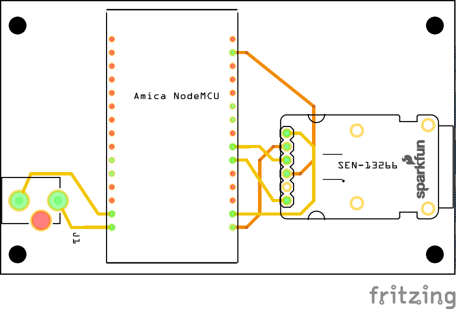

# Ultra Low Temperature Freezer Monitor

A quick and cheap WiFi enabled sensor monitor for Ultra Low Temperature Freezers (ULTs) or any -80C  

This was made for monitoring vaccines and other biological samples which requires to be under -80C

## Parts
* 1 Amica NodeMCU
* 1 SparkFun Thermocouple Breakout - MAX31855K [SEN-13266](https://www.sparkfun.com/products/13266
)
* 1 Thermocouple Connector - PCC-SMP-K [PRT-13612](https://www.sparkfun.com/products/13612)
* 1 DC Barrel Power Jack/Connector [PRT-00119](https://www.sparkfun.com/products/119)
* 1 Thermocouple K-Type 3x15mmm Cylindrical sensor 1M length
